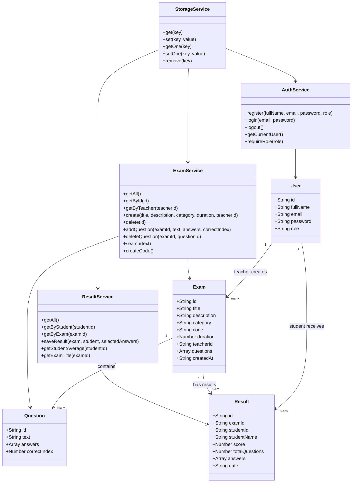

# מערכת מבחנים צד לקוח - Client Side Exam System

שם: Neris Isleyen  
ת.ז: 213501182  

קישור לפרויקט בגיטהאב:  
https://github.com/isleyenneris-lab/exam-client-project

---

## הסבר כללי

הפרויקט הוא מערכת מבחנים מלאה שפועלת בדפדפן בלבד, ללא צד שרת.

המערכת נבנתה כחלק מפרויקט המשך בקורס תכנות בסביבת האינטרנט.

המערכת משתמשת ב:

- HTML
- CSS
- Bootstrap
- JavaScript
- ES Modules
- OOP Classes
- JSON
- localStorage

כל המידע נשמר בדפדפן באמצעות `localStorage`.

---

## תפקידי משתמשים

במערכת קיימים שני סוגי משתמשים:

### מורה

המורה יכול:

- ליצור מבחנים חדשים
- לראות את רשימת המבחנים שהוא יצר
- להיכנס לדף פרטי מבחן
- להוסיף שאלות למבחן
- למחוק שאלות
- למחוק מבחנים
- לראות תוצאות של סטודנטים שביצעו את המבחן

### סטודנט

הסטודנט יכול:

- להירשם ולהתחבר למערכת
- לחפש מבחן לפי שם או לפי קוד מבחן
- לבצע מבחן
- לשלוח תשובות
- לראות ציון מיד לאחר סיום המבחן
- לראות היסטוריית מבחנים
- לראות ממוצע ציונים

---

## דפים במערכת

### index.html

דף ראשי של המערכת.

הדף כולל:

- שם הסטודנטית
- תעודת זהות
- קישור לגיטהאב
- קישור להרשמה
- קישור להתחברות

### register.html

דף הרשמה למשתמש חדש.

בדף זה המשתמש מכניס:

- שם מלא
- אימייל
- סיסמה
- סוג משתמש: מורה או סטודנט

### login.html

דף התחברות למשתמש קיים.

לאחר התחברות מוצלחת:

- מורה עובר לדף `teacher.html`
- סטודנט עובר לדף `student.html`

### teacher.html

דף ראשי למורה.

בדף זה המורה יכול:

- ליצור מבחן חדש
- לראות את כל המבחנים שהוא יצר
- לעבור לדף פרטי מבחן
- למחוק מבחן

### exam-details.html

דף פרטי מבחן.

בדף זה מוצגים:

- ID של המבחן
- שם המבחן
- תיאור
- קטגוריה
- קוד למציאת מבחן
- משך זמן
- רשימת שאלות
- תשובות אפשריות
- תשובה נכונה
- תוצאות סטודנטים

### student.html

דף ראשי לסטודנט.

בדף זה הסטודנט רואה:

- מבחנים שכבר ביצע
- ציונים קודמים
- ממוצע ציונים
- קישור לדף חיפוש מבחן

### search.html

דף חיפוש מבחן.

בדף זה הסטודנט יכול לחפש מבחן לפי:

- שם מבחן
- קוד מבחן

לחיצה על מבחן מעבירה לדף ביצוע המבחן.

### take-exam.html

דף ביצוע מבחן.

בדף זה מוצגים:

- שם המבחן
- שאלות אמריקאיות
- תשובות לבחירה
- כפתור סיום ושליחת מבחן

לאחר השליחה, הציון נשמר ומוצג לסטודנט.

---

## מבנה הקבצים

```text
exam-client-project/
│
├── index.html
├── register.html
├── login.html
├── teacher.html
├── exam-details.html
├── student.html
├── search.html
├── take-exam.html
├── README.md
│
├── css/
│   └── style.css
│
└── js/
    ├── models/
    │   ├── User.js
    │   ├── Exam.js
    │   ├── Question.js
    │   └── Result.js
    │
    ├── services/
    │   ├── StorageService.js
    │   ├── AuthService.js
    │   ├── ExamService.js
    │   └── ResultService.js
    │
    └── pages/
        ├── registerPage.js
        ├── loginPage.js
        ├── teacherPage.js
        ├── examDetailsPage.js
        ├── studentPage.js
        ├── searchPage.js
        └── takeExamPage.js
```

---

## הסבר על מחלקות OOP

### User

מחלקה שמייצגת משתמש במערכת.

שדות עיקריים:

- id
- fullName
- email
- password
- role

ה־role יכול להיות:

- teacher
- student

### Exam

מחלקה שמייצגת מבחן.

שדות עיקריים:

- id
- title
- description
- category
- code
- duration
- teacherId
- questions
- createdAt

### Question

מחלקה שמייצגת שאלה אמריקאית.

שדות עיקריים:

- id
- text
- answers
- correctIndex

### Result

מחלקה שמייצגת תוצאה של סטודנט במבחן.

שדות עיקריים:

- id
- examId
- studentId
- studentName
- score
- totalQuestions
- answers
- date

---

## Services במערכת

### StorageService

אחראי על שמירה ושליפה של מידע מתוך `localStorage`.

הוא משתמש ב־JSON כדי להמיר מידע לאובייקטים ולשמור אותם בדפדפן.

### AuthService

אחראי על:

- הרשמה
- התחברות
- התנתקות
- בדיקת משתמש מחובר
- בדיקת הרשאות לפי תפקיד

### ExamService

אחראי על:

- יצירת מבחן
- מחיקת מבחן
- שליפת מבחנים
- חיפוש מבחנים
- הוספת שאלות
- מחיקת שאלות

### ResultService

אחראי על:

- שמירת תוצאות מבחן
- חישוב ציון
- הצגת תוצאות לפי סטודנט
- הצגת תוצאות לפי מבחן
- חישוב ממוצע ציונים

---

## OOP Diagram



---

## שימוש ב-localStorage

המערכת שומרת מידע בדפדפן תחת המפתחות הבאים:

```text
examAppUsers
examAppCurrentUser
examAppExams
examAppResults
```

המידע נשמר כ־JSON.

לדוגמה:

- משתמשים נשמרים ב־`examAppUsers`
- המשתמש המחובר נשמר ב־`examAppCurrentUser`
- מבחנים נשמרים ב־`examAppExams`
- תוצאות נשמרות ב־`examAppResults`

---

## איך להריץ את הפרויקט

יש לפתוח את הפרויקט ב־VS Code.

לאחר מכן יש להפעיל את הפרויקט בעזרת Live Server.

שלבים:

1. לפתוח את התיקייה של הפרויקט ב־VS Code.
2. להתקין תוסף בשם Live Server.
3. ללחוץ קליק ימני על `index.html`.
4. לבחור `Open with Live Server`.

---

## בדיקת המערכת

### בדיקת מורה

1. להיכנס לדף הרשמה.
2. ליצור משתמש מסוג מורה.
3. להתחבר למערכת.
4. ליצור מבחן חדש.
5. להיכנס לפרטי המבחן.
6. להוסיף שאלות ותשובות.
7. לשמור את קוד המבחן.

### בדיקת סטודנט

1. להתנתק מהמורה.
2. ליצור משתמש מסוג סטודנט.
3. להתחבר למערכת.
4. לעבור לדף חיפוש מבחן.
5. לחפש מבחן לפי שם או קוד.
6. לבצע את המבחן.
7. לשלוח תשובות.
8. לראות ציון.
9. לבדוק שהציון מופיע בדף הסטודנט.

---

## Git Commits

הפרויקט נשמר בגיט באמצעות commits.

דוגמאות ל־commits:

```bash
git add .
git commit -m "Add home page and main design"

git add .
git commit -m "Add exam client side project"

git add README.md
git commit -m "Add OOP diagram to README"
```

---

## הערות

הפרויקט הוא פרויקט צד לקוח בלבד.

אין שימוש בשרת או בבסיס נתונים אמיתי.

הנתונים נשמרים רק בדפדפן באמצעות `localStorage`.

במערכת אמיתית לא שומרים סיסמאות ב־localStorage, אך בפרויקט זה הדבר נעשה לצורך לימודי בלבד.